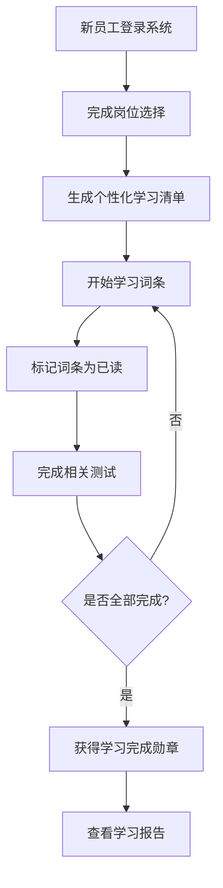
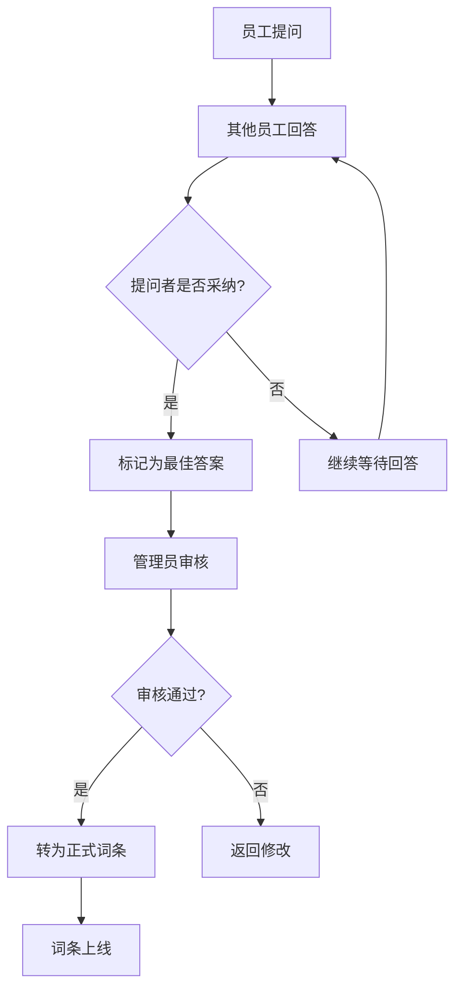
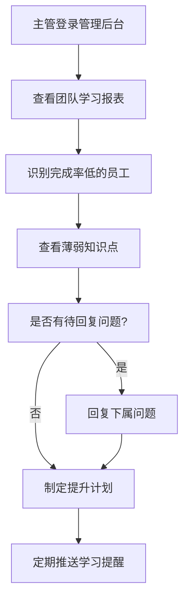
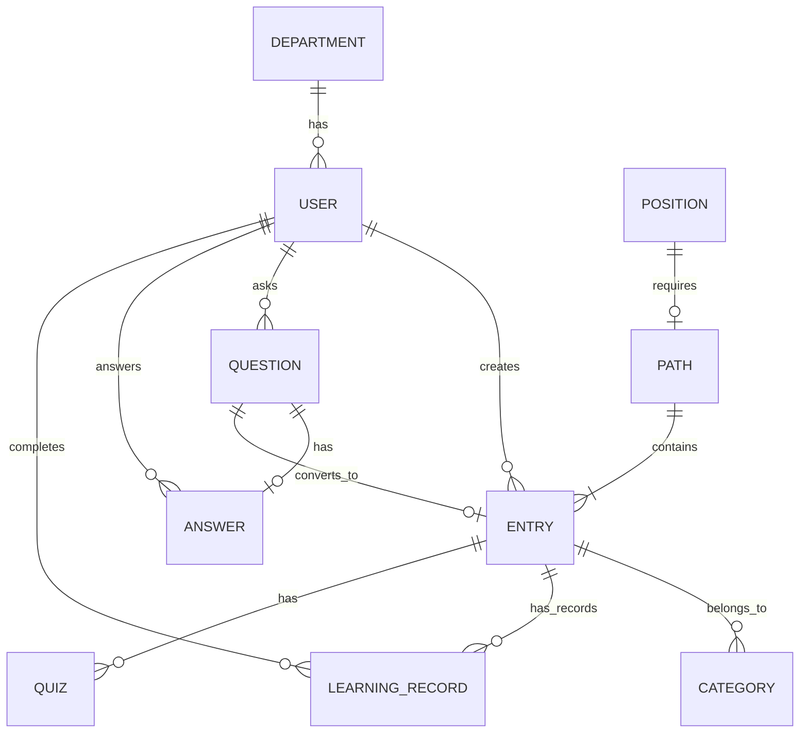

# 公司知识百科 Web 应用 - 产品需求文档

## 1. 产品概述

公司知识百科是一款面向新员工入职学习和跨部门协作查询的企业内部知识管理系统。通过结构化的知识地图、互动式问答和学习进度追踪，帮助新员工快速融入团队，同时促进跨部门知识共享与协作。

**核心价值：**
- 缩短新员工上手周期，降低培训成本
- 打破信息孤岛，促进跨部门协作
- 沉淀组织知识资产，积累企业智力资本
- 量化学习效果，帮助管理层洞察团队能力

**目标用户：**
- 新入职员工：快速了解公司制度、文化、业务流程
- 在职员工：查询跨部门知识，解决工作中的疑问
- 部门主管：追踪团队学习进度，识别知识薄弱点
- 知识管理员：维护和更新知识库内容

## 2. 核心功能

### 2.1 用户角色

| 角色 | 注册方式 | 核心权限 |
|------|----------|----------|
| 普通员工 | 企业邮箱登录 | 浏览知识、提问回答、标记已读、参加测试 |
| 部门主管 | 管理员分配 | 查看团队进度、回复待解答问题、审核词条 |
| 知识管理员 | 管理员分配 | 创建/编辑词条、管理主题路径、审核问答 |

### 2.2 功能模块

1. **入职导航页**：新员工第一天的一站式学习入口，包含必读清单、入职清单、公司介绍视频等
2. **知识地图页**：可视化知识分类与主题路径展示，支持按部门、岗位、主题筛选
3. **问答专区页**：员工提问、回答、采纳答案，支持追问与追问回复
4. **词条详情页**：知识条目的完整内容展示，包含负责人、部门、更新时间、关联阅读等元信息
5. **学习进度页**：个人学习看板、岗位学习清单、测试成绩、薄弱知识点
6. **管理后台**：知识管理员的内容管理界面

### 2.3 页面详细说明

#### 2.3.1 入职导航页

| 模块名称 | 功能描述 |
|---------|---------|
| 欢迎横幅 | 员工姓名、入职天数、欢迎语 |
| 必读清单 | 新员工必须完成的学习任务列表 |
| 入职清单 | 第一周要完成的事项（如领取工牌、开通系统账号） |
| 快速入口 | 常用系统链接（OA、邮箱、考勤等） |
| 公司介绍 | 公司历史、愿景使命、核心价值观 |
| 近期公告 | 最新公司通知和活动信息 |

#### 2.3.2 知识地图页

| 模块名称 | 功能描述 |
|---------|---------|
| 分类导航 | 左侧分类树（制度类、系统类、FAQ类、术语类） |
| 主题路径 | 管理员配置的完整学习路径，如"财务报销全流程" |
| 知识卡片 | 词条预览卡片，显示标题、摘要、阅读量 |
| 搜索栏 | 关键词搜索，支持模糊匹配 |
| 筛选器 | 按部门、岗位、更新时间、难度筛选 |
| 热门推荐 | 阅读量最高的词条推荐 |

#### 2.3.3 问答专区页

| 模块名称 | 功能描述 |
|---------|---------|
| 问题列表 | 展示所有问答，支持按状态（待解答/已采纳/全部）筛选 |
| 提问表单 | 提交新问题，支持选择分类和标签 |
| 问题详情 | 问题内容、回答列表、追问功能 |
| 采纳机制 | 提问者可采纳最佳答案，采纳后可转为词条 |
| 标签系统 | 支持按标签筛选，如"报销"、"请假"、"IT支持" |
| 悬赏机制 | 提问者可设置积分悬赏，激励回答 |

#### 2.3.4 词条详情页

| 模块名称 | 功能描述 |
|---------|---------|
| 词条标题 | 词条名称和分类标签 |
| 词条正文 | 支持富文本、表格、图片、视频 |
| 元信息栏 | 负责人、适用部门、创建时间、更新时间、版本号 |
| 阅读统计 | 阅读量、收藏量、点赞数 |
| 相关阅读 | 自动推荐相关词条 |
| 关联问答 | 显示被采纳成为词条的问答来源 |
| 操作栏 | 收藏、分享、纠错、打印 |

#### 2.3.5 学习进度页

| 模块名称 | 功能描述 |
|---------|---------|
| 进度总览 | 整体完成百分比、已完成/总任务数 |
| 岗位清单 | 按当前岗位推荐的学习清单，支持勾选标记 |
| 学习记录 | 已读词条历史、学习时长统计 |
| 测验成绩 | 各类测试得分、错题本 |
| 薄弱知识点 | 根据测试结果推荐需要加强的内容 |
| 勋章墙 | 完成特定学习任务获得的成就徽章 |

#### 2.3.6 管理后台（主管视角）

| 模块名称 | 功能描述 |
|---------|---------|
| 团队进度 | 下属员工的学习完成率排名 |
| 薄弱分析 | 团队整体薄弱知识点分布图 |
| 待回复问题 | 团队成员提出的待解答问题列表 |
| 词条审核 | 待审核的新建/编辑词条 |
| 数据导出 | 导出学习报表、问答统计 |

#### 2.3.7 管理后台（知识管理员视角）

| 模块名称 | 功能描述 |
|---------|---------|
| 词条管理 | 创建、编辑、删除词条，支持富文本编辑 |
| 主题路径 | 创建学习路径，指定包含的词条和顺序 |
| 分类管理 | 添加/编辑/删除知识分类 |
| 问答审核 | 审核被采纳的问题，转为正式词条 |
| 用户管理 | 分配角色、查看用户学习统计 |
| 数据统计 | 知识库整体访问量、热门词条、用户活跃度 |

## 3. 核心流程

### 3.1 新员工入职学习流程



### 3.2 问答采纳与词条沉淀流程



### 3.3 团队学习追踪流程



## 4. 用户界面设计

### 4.1 设计风格

**设计理念：**
- **现代企业风格**：简洁专业、高效清晰，体现企业级应用的可靠性
- **知识导向**：以内容为核心，弱化装饰性元素
- **温暖友好**：避免冰冷的界面感，增加亲和力和学习意愿

**色彩方案：**
- 主色调：`#4F46E5`（靛蓝色）- 代表专业、信任、知识
- 辅助色：`#10B981`（翠绿色）- 代表成长、进步、成就
- 警示色：`#F59E0B`（琥珀色）- 用于待办、提醒
- 背景色：`#F8FAFC`（浅灰白）- 干净舒适的阅读体验
- 深色背景：`#1E293B`（深蓝灰）- 用于侧边栏和导航
- 文字色：`#334155`（深灰）- 高可读性

**字体选择：**
- 标题字体：`Noto Sans SC`（思源黑体）- 现代、专业、中文支持优秀
- 正文字体：`Noto Sans SC` - 保持一致性
- 数字/代码：`JetBrains Mono` - 数据展示更清晰

**布局风格：**
- 左侧固定导航 + 右侧内容区
- 卡片式内容展示
- 响应式布局，适配桌面和平板
- 顶部搜索栏 + 用户信息区

**图标风格：**
- 使用 Lucide Icons（线性风格）
- 统一 24px 尺寸
- 保持一致的描边宽度

**动画效果：**
- 页面切换：淡入淡出，300ms
- 卡片悬停：轻微上浮 + 阴影加深
- 进度条：流畅的数值滚动动画
- 加载状态：骨架屏 + 脉冲动画

### 4.2 页面设计概览

#### 4.2.1 入职导航页

| 模块 | 样式 | 布局 | 颜色 | 字体 | 动画 |
|------|------|------|------|------|------|
| 欢迎横幅 | 全宽渐变背景 | 左文右图 | 主色渐变 | 大标题 32px | 入场动画从上到下 |
| 必读清单 | 卡片列表 | 网格 3 列 | 白底 + 主色边框 | 正文 16px | 逐项渐入，间隔 100ms |
| 快速入口 | 图标按钮组 | 水平滚动 | 白底图标 | 图标 24px | 悬停放大 1.1 倍 |
| 公司介绍 | 左右分栏 | 左文右图 | 浅灰背景 | 正文 16px | 滚动触发动画 |

#### 4.2.2 知识地图页

| 模块 | 样式 | 布局 | 颜色 | 字体 | 动画 |
|------|------|------|------|------|------|
| 分类导航 | 垂直菜单 | 左侧固定 240px | 深色背景 | 正文 14px | 选中项高亮滑动 |
| 主题路径 | 卡片 + 进度条 | 网格响应式 | 白底阴影 | 标题 18px | 悬停卡片上浮 |
| 知识卡片 | 简洁卡片 | 网格 3-4 列 | 白底 | 标题 16px | 悬停阴影加深 |
| 搜索栏 | 圆角输入框 | 顶部居中 | 白底 + 主色聚焦 | 正文 14px | 聚焦时边框动画 |

#### 4.2.3 问答专区页

| 模块 | 样式 | 布局 | 颜色 | 字体 | 动画 |
|------|------|------|------|------|------|
| 问题卡片 | 卡片列表 | 居中 800px | 白底阴影 | 标题 18px | 悬停背景色变浅 |
| 回答区 | 分隔线区分 | 缩进布局 | 浅灰背景 | 正文 16px | 新回答滑入 |
| 采纳标记 | 徽章样式 | 右上角 | 绿色背景 | 白字 12px | 采纳时放大弹跳 |
| 提问按钮 | 圆形浮动按钮 | 右下角固定 | 主色背景 | 图标 + 文字 | 悬停旋转 |

#### 4.2.4 词条详情页

| 模块 | 样式 | 布局 | 颜色 | 字体 | 动画 |
|------|------|------|------|------|------|
| 面包屑导航 | 链接文字 | 顶部居左 | 主色链接 | 正文 14px | 点击跳转动画 |
| 词条正文 | Markdown 渲染 | 居中 800px | 白底 | 正文字体 16px | 滚动阅读进度指示 |
| 元信息栏 | 紧凑横排 | 标题下方 | 浅灰背景 | 小字 12px | 静态展示 |
| 相关阅读 | 卡片列表 | 底部横排 | 白底 | 标题 14px | 悬停卡片上浮 |

#### 4.2.5 学习进度页

| 模块 | 样式 | 布局 | 颜色 | 字体 | 动画 |
|------|------|------|------|------|------|
| 进度环 | 环形进度条 | 居中大圆 | 主色填充 | 百分比 48px | 数值滚动动画 |
| 学习清单 | 勾选列表 | 左侧固定 | 绿勾/灰未选 | 正文 16px | 勾选时划线动画 |
| 测验图表 | 柱状/雷达图 | 网格布局 | 多色系 | 数值标签 | 数据加载动画 |
| 勋章墙 | 徽章图标 | 网格展示 | 金/银/铜色 | 名称标签 | 获得时发光动画 |

### 4.3 响应式设计

- **桌面端（1200px+）**：完整三栏布局，侧边导航
- **平板端（768px-1199px）**：折叠侧边栏，内容区自适应
- **移动端（<768px）**：底部标签导航，单栏布局（此应用以桌面为主，移动端仅提供基础浏览功能）

## 5. 数据结构设计

### 5.1 核心实体

| 实体 | 主要字段 | 说明 |
|------|---------|------|
| User | id, name, email, department, position, role, avatar | 用户信息 |
| Entry | id, title, content, author_id, category_id, responsible_id, departments, created_at, updated_at, version, view_count, favorite_count | 知识词条 |
| Category | id, name, parent_id, icon, sort_order | 知识分类 |
| Path | id, title, description, entry_ids, required_for_positions | 主题学习路径 |
| Question | id, title, content, author_id, category_id, status, adopted_answer_id, score | 问答问题 |
| Answer | id, question_id, content, author_id, is_adopted, created_at | 问答回答 |
| LearningRecord | id, user_id, entry_id, status, progress, started_at, completed_at | 学习记录 |
| Quiz | id, entry_id, questions, passing_score | 关联测验 |
| QuizResult | id, user_id, quiz_id, score, answers, completed_at | 测验成绩 |
| Department | id, name, manager_id | 部门信息 |
| Position | id, name, department_id, learning_path_id | 岗位信息 |

### 5.2 关系图



## 6. 技术架构

### 6.1 前端技术栈

- **框架**：React 18 + TypeScript
- **样式**：Tailwind CSS 3
- **路由**：React Router v6
- **状态管理**：React Context + Hooks
- **HTTP 客户端**：Axios（模拟数据）
- **构建工具**：Vite
- **图表库**：Recharts
- **图标库**：Lucide React

### 6.2 项目结构

```
src/
├── components/        # 可复用组件
│   ├── layout/       # 布局组件（侧边栏、头部）
│   ├── common/       # 通用组件（按钮、卡片、输入框）
│   └── domain/      # 业务组件（词条卡片、问题卡片等）
├── pages/            # 页面组件
│   ├── Onboarding/  # 入职导航页
│   ├── KnowledgeMap/ # 知识地图页
│   ├── QnA/         # 问答专区页
│   ├── Entry/       # 词条详情页
│   ├── Progress/    # 学习进度页
│   └── Admin/       # 管理后台页
├── contexts/         # React Context
├── hooks/           # 自定义 Hooks
├── services/        # API 服务层
├── types/           # TypeScript 类型定义
├── utils/           # 工具函数
├── data/            # 模拟数据
└── styles/          # 全局样式
```

### 6.3 路由设计

| 路由 | 页面 | 权限 |
|------|------|------|
| / | 首页/入职导航 | 所有用户 |
| /map | 知识地图 | 所有用户 |
| /qa | 问答专区 | 所有用户 |
| /qa/:id | 问题详情 | 所有用户 |
| /entry/:id | 词条详情 | 所有用户 |
| /progress | 学习进度 | 所有用户 |
| /admin/dashboard | 管理仪表盘 | 主管/管理员 |
| /admin/team | 团队管理 | 主管 |
| /admin/entries | 词条管理 | 管理员 |
| /admin/paths | 路径管理 | 管理员 |

## 7. 里程碑规划

### Phase 1 - MVP 版本（当前）
- ✅ 入职导航页
- ✅ 知识地图页
- ✅ 问答专区页
- ✅ 词条详情页
- ✅ 学习进度页
- ✅ 基础管理功能

### Phase 2 - 增强功能
- [ ] 实时通知系统
- [ ] 高级搜索与过滤
- [ ] 数据分析报表
- [ ] 移动端适配

### Phase 3 - 智能化
- [ ] 智能推荐算法
- [ ] 知识图谱可视化
- [ ] AI 辅助回答
