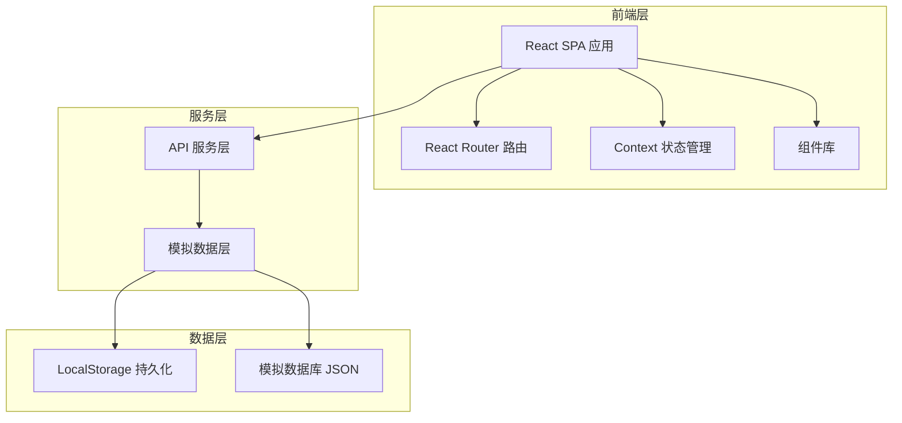
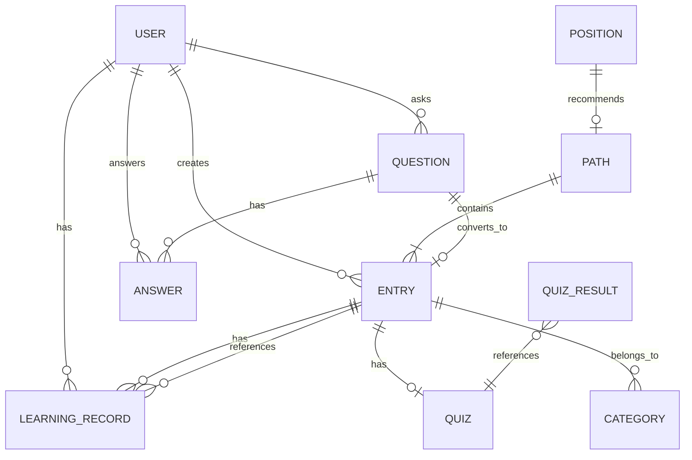

# 公司知识百科 Web 应用 - 技术架构文档

## 1. 架构设计

### 1.1 系统架构图



### 1.2 技术栈概览

| 层级 | 技术选型 | 说明 |
|------|---------|------|
| 前端框架 | React 18 + TypeScript | 类型安全，组件化开发 |
| 构建工具 | Vite | 快速热更新，优化打包 |
| 样式方案 | Tailwind CSS | 原子化 CSS，高效开发 |
| 路由管理 | React Router v6 | 客户端路由，嵌套路由 |
| 状态管理 | React Context + Hooks | 轻量级，无需额外依赖 |
| 数据请求 | Axios + Mock | 模拟后端 API |
| 图表组件 | Recharts | React 原生图表库 |
| 图标库 | Lucide React | 轻量、一致的图标集 |
| 日期处理 | Day.js | 轻量级日期库 |
| 动画库 | Framer Motion | 流畅的交互动画 |

## 2. 项目结构

```
company-knowledge-base/
├── public/
│   └── vite.svg
├── src/
│   ├── components/
│   │   ├── layout/           # 布局组件
│   │   │   ├── Sidebar.tsx   # 侧边导航
│   │   │   ├── Header.tsx    # 顶部栏
│   │   │   └── Layout.tsx    # 主布局
│   │   ├── common/           # 通用组件
│   │   │   ├── Button.tsx
│   │   │   ├── Card.tsx
│   │   │   ├── Input.tsx
│   │   │   ├── Badge.tsx
│   │   │   ├── Modal.tsx
│   │   │   ├── Progress.tsx
│   │   │   └── Empty.tsx
│   │   └── domain/           # 业务组件
│   │       ├── EntryCard.tsx
│   │       ├── QuestionCard.tsx
│   │       ├── AnswerItem.tsx
│   │       ├── PathCard.tsx
│   │       ├── CategoryNav.tsx
│   │       ├── LearningItem.tsx
│   │       └── QuizModal.tsx
│   ├── pages/
│   │   ├── Onboarding/       # 入职导航
│   │   │   └── OnboardingPage.tsx
│   │   ├── KnowledgeMap/     # 知识地图
│   │   │   └── KnowledgeMapPage.tsx
│   │   ├── QnA/              # 问答专区
│   │   │   ├── QnAListPage.tsx
│   │   │   └── QuestionDetailPage.tsx
│   │   ├── Entry/            # 词条详情
│   │   │   └── EntryDetailPage.tsx
│   │   ├── Progress/         # 学习进度
│   │   │   └── ProgressPage.tsx
│   │   └── Admin/            # 管理后台
│   │       ├── AdminDashboard.tsx
│   │       ├── TeamManagement.tsx
│   │       └── EntryManagement.tsx
│   ├── contexts/
│   │   ├── AuthContext.tsx   # 用户认证上下文
│   │   ├── KnowledgeContext.tsx  # 知识库上下文
│   │   └── LearningContext.tsx   # 学习进度上下文
│   ├── hooks/
│   │   ├── useAuth.ts
│   │   ├── useKnowledge.ts
│   │   ├── useLearning.ts
│   │   └── useProgress.ts
│   ├── services/
│   │   ├── api.ts            # API 请求封装
│   │   ├── authService.ts    # 认证服务
│   │   ├── knowledgeService.ts  # 知识服务
│   │   ├── qaService.ts      # 问答服务
│   │   └── learningService.ts  # 学习服务
│   ├── types/
│   │   ├── user.ts
│   │   ├── entry.ts
│   │   ├── question.ts
│   │   ├── learning.ts
│   │   └── index.ts
│   ├── data/
│   │   ├── mockUsers.ts
│   │   ├── mockEntries.ts
│   │   ├── mockQuestions.ts
│   │   ├── mockCategories.ts
│   │   └── mockPaths.ts
│   ├── utils/
│   │   ├── storage.ts        # LocalStorage 工具
│   │   ├── date.ts           # 日期格式化
│   │   └── helpers.ts        # 辅助函数
│   ├── styles/
│   │   └── globals.css       # 全局样式
│   ├── App.tsx               # 根组件
│   ├── main.tsx              # 入口文件
│   └── vite-env.d.ts
├── index.html
├── package.json
├── tsconfig.json
├── tailwind.config.js
├── vite.config.ts
└── README.md
```

## 3. 路由定义

### 3.1 路由配置

| 路由路径 | 组件 | 布局 | 说明 |
|---------|------|------|------|
| `/` | OnboardingPage | MainLayout | 入职导航首页 |
| `/map` | KnowledgeMapPage | MainLayout | 知识地图 |
| `/map/category/:id` | KnowledgeMapPage | MainLayout | 按分类查看 |
| `/map/path/:id` | KnowledgeMapPage | MainLayout | 按路径查看 |
| `/qa` | QnAListPage | MainLayout | 问答列表 |
| `/qa/ask` | AskQuestionPage | MainLayout | 提问页面 |
| `/qa/:id` | QuestionDetailPage | MainLayout | 问题详情 |
| `/entry/:id` | EntryDetailPage | MainLayout | 词条详情 |
| `/progress` | ProgressPage | MainLayout | 学习进度 |
| `/admin` | AdminDashboard | AdminLayout | 管理仪表盘 |
| `/admin/team` | TeamManagement | AdminLayout | 团队管理 |
| `/admin/entries` | EntryManagement | AdminLayout | 词条管理 |

### 3.2 路由守卫

```typescript
// 路由守卫逻辑
const PrivateRoute = ({ children, roles }: { children: React.ReactNode; roles?: UserRole[] }) => {
  const { user } = useAuth();
  
  if (!user) {
    return <Navigate to="/login" replace />;
  }
  
  if (roles && !roles.includes(user.role)) {
    return <Navigate to="/" replace />;
  }
  
  return children;
};
```

## 4. 数据模型定义

### 4.1 核心类型定义

```typescript
// 用户类型
interface User {
  id: string;
  name: string;
  email: string;
  avatar?: string;
  department: string;
  position: string;
  role: 'employee' | 'manager' | 'admin';
  joinDate: string;
}

// 词条类型
interface Entry {
  id: string;
  title: string;
  content: string;
  summary: string;
  categoryId: string;
  responsibleId: string;
  responsibleName: string;
  departments: string[];
  tags: string[];
  viewCount: number;
  favoriteCount: number;
  createdAt: string;
  updatedAt: string;
  version: number;
  relatedEntries: string[];
  relatedQuestions: string[];
}

// 分类类型
interface Category {
  id: string;
  name: string;
  icon: string;
  parentId?: string;
  sortOrder: number;
  entryCount: number;
}

// 学习路径类型
interface LearningPath {
  id: string;
  title: string;
  description: string;
  entryIds: string[];
  requiredForPositions: string[];
  estimatedMinutes: number;
  progress?: number;
}

// 问题类型
interface Question {
  id: string;
  title: string;
  content: string;
  authorId: string;
  authorName: string;
  authorAvatar?: string;
  categoryId: string;
  tags: string[];
  status: 'pending' | 'answered' | 'adopted';
  adoptedAnswerId?: string;
  viewCount: number;
  answerCount: number;
  score: number;
  createdAt: string;
  updatedAt: string;
}

// 回答类型
interface Answer {
  id: string;
  questionId: string;
  content: string;
  authorId: string;
  authorName: string;
  authorAvatar?: string;
  isAdopted: boolean;
  upvotes: number;
  createdAt: string;
  updatedAt: string;
}

// 学习记录类型
interface LearningRecord {
  id: string;
  userId: string;
  entryId: string;
  status: 'not_started' | 'in_progress' | 'completed';
  progress: number;
  startedAt?: string;
  completedAt?: string;
  timeSpent: number;
}

// 测验类型
interface Quiz {
  id: string;
  entryId: string;
  questions: QuizQuestion[];
  passingScore: number;
}

interface QuizQuestion {
  id: string;
  question: string;
  options: string[];
  correctAnswer: number;
}

interface QuizResult {
  id: string;
  userId: string;
  quizId: string;
  score: number;
  totalQuestions: number;
  correctCount: number;
  answers: number[];
  completedAt: string;
}
```

### 4.2 实体关系图



## 5. API 服务设计

### 5.1 API 请求封装

```typescript
// services/api.ts
import axios from 'axios';

const api = axios.create({
  baseURL: '/api',
  timeout: 10000,
});

api.interceptors.request.use((config) => {
  const token = localStorage.getItem('token');
  if (token) {
    config.headers.Authorization = `Bearer ${token}`;
  }
  return config;
});

export default api;
```

### 5.2 服务接口定义

```typescript
// 知识服务
export const knowledgeService = {
  getEntries: (params?: QueryParams) => Promise<Entry[]>,
  getEntryById: (id: string) => Promise<Entry>,
  getCategories: () => Promise<Category[]>,
  getPaths: () => Promise<LearningPath[]>,
  getEntriesByCategory: (categoryId: string) => Promise<Entry[]>,
  getEntriesByPath: (pathId: string) => Promise<Entry[]>,
  searchEntries: (keyword: string) => Promise<Entry[]>,
};

// 问答服务
export const qaService = {
  getQuestions: (params?: QueryParams) => Promise<Question[]>,
  getQuestionById: (id: string) => Promise<Question>,
  getAnswers: (questionId: string) => Promise<Answer[]>,
  createQuestion: (data: CreateQuestionDTO) => Promise<Question>,
  createAnswer: (questionId: string, data: CreateAnswerDTO) => Promise<Answer>,
  adoptAnswer: (questionId: string, answerId: string) => Promise<void>,
  convertToEntry: (questionId: string) => Promise<Entry>,
};

// 学习服务
export const learningService = {
  getLearningRecords: (userId: string) => Promise<LearningRecord[]>,
  updateProgress: (entryId: string, progress: number) => Promise<void>,
  markAsCompleted: (entryId: string) => Promise<void>,
  getQuiz: (entryId: string) => Promise<Quiz>,
  submitQuiz: (quizId: string, answers: number[]) => Promise<QuizResult>,
  getProgressStats: (userId: string) => Promise<ProgressStats>,
};

// 管理服务
export const adminService = {
  getTeamMembers: (managerId: string) => Promise<User[]>,
  getTeamProgress: (managerId: string) => Promise<TeamProgress[]>,
  getTeamWeakPoints: (managerId: string) => Promise<WeakPoint[]>,
  getPendingQuestions: (department: string) => Promise<Question[]>,
};
```

## 6. 状态管理设计

### 6.1 AuthContext

```typescript
// contexts/AuthContext.tsx
interface AuthState {
  user: User | null;
  isAuthenticated: boolean;
  isLoading: boolean;
}

interface AuthContextValue extends AuthState {
  login: (email: string, password: string) => Promise<void>;
  logout: () => void;
  updateProfile: (data: Partial<User>) => Promise<void>;
}
```

### 6.2 KnowledgeContext

```typescript
// contexts/KnowledgeContext.tsx
interface KnowledgeState {
  entries: Entry[];
  categories: Category[];
  paths: LearningPath[];
  currentEntry: Entry | null;
  currentCategory: Category | null;
  searchResults: Entry[];
  isLoading: boolean;
}

interface KnowledgeContextValue extends KnowledgeState {
  fetchEntries: (params?: QueryParams) => Promise<void>;
  fetchEntryById: (id: string) => Promise<void>;
  fetchCategories: () => Promise<void>;
  search: (keyword: string) => Promise<void>;
  setCurrentCategory: (category: Category | null) => void;
}
```

### 6.3 LearningContext

```typescript
// contexts/LearningContext.tsx
interface LearningState {
  records: LearningRecord[];
  quizResults: QuizResult[];
  currentQuiz: Quiz | null;
  progressStats: ProgressStats | null;
  isLoading: boolean;
}

interface LearningContextValue extends LearningState {
  fetchRecords: () => Promise<void>;
  updateProgress: (entryId: string, progress: number) => Promise<void>;
  startQuiz: (entryId: string) => Promise<void>;
  submitQuiz: (answers: number[]) => Promise<QuizResult>;
  fetchStats: () => Promise<void>;
}
```

## 7. 组件设计规范

### 7.1 通用组件清单

| 组件 | Props | 说明 |
|------|-------|------|
| Button | variant, size, disabled, loading, onClick | 按钮组件，支持多种样式 |
| Card | title, extra, children, hoverable | 卡片容器 |
| Input | type, value, placeholder, error, onChange | 输入框组件 |
| Select | options, value, onChange, placeholder | 下拉选择器 |
| Badge | count, status, text | 徽章/标签组件 |
| Modal | open, title, onClose, children | 模态框组件 |
| Progress | percent, status, showText | 进度条组件 |
| Empty | description, action | 空状态组件 |
| Avatar | src, name, size | 用户头像组件 |
| Tag | closable, onClose | 标签组件 |
| Tooltip | content, children | 提示组件 |
| Skeleton | active, loading | 骨架屏组件 |

### 7.2 业务组件清单

| 组件 | 说明 |
|------|------|
| EntryCard | 词条卡片，显示标题、摘要、分类、阅读量 |
| QuestionCard | 问题卡片，显示标题、状态、回答数、悬赏分 |
| AnswerItem | 回答项，支持采纳、点赞操作 |
| PathCard | 学习路径卡片，显示路径名称、进度、预估时间 |
| CategoryNav | 分类导航菜单 |
| LearningItem | 学习清单项，支持勾选标记 |
| QuizModal | 测验弹窗，支持答题和提交 |
| ProgressRing | 环形进度条组件 |
| StatsCard | 统计数据卡片 |
| TeamMemberCard | 团队成员卡片 |
| WeakPointItem | 薄弱知识点项 |

## 8. Mock 数据结构

### 8.1 模拟用户数据

```typescript
// data/mockUsers.ts
export const mockUsers: User[] = [
  {
    id: '1',
    name: '张明',
    email: 'zhangming@company.com',
    department: '技术部',
    position: '前端工程师',
    role: 'employee',
    joinDate: '2024-01-15',
  },
  {
    id: '2',
    name: '李华',
    email: 'lihua@company.com',
    department: '人力资源部',
    position: 'HR主管',
    role: 'manager',
    joinDate: '2020-06-01',
  },
  // ...
];
```

### 8.2 模拟词条数据

```typescript
// data/mockEntries.ts
export const mockEntries: Entry[] = [
  {
    id: '1',
    title: '公司报销制度',
    content: '<p>报销制度详细内容...</p>',
    summary: '介绍公司各项费用的报销流程和标准',
    categoryId: '1',
    responsibleId: '2',
    responsibleName: '财务部',
    departments: ['全部'],
    tags: ['报销', '财务', '制度'],
    viewCount: 1250,
    favoriteCount: 89,
    createdAt: '2024-01-10',
    updatedAt: '2024-03-15',
    version: 3,
    relatedEntries: ['2', '3'],
    relatedQuestions: ['1', '5'],
  },
  // ...
];
```

### 8.3 模拟问答数据

```typescript
// data/mockQuestions.ts
export const mockQuestions: Question[] = [
  {
    id: '1',
    title: '如何申请年假？',
    content: '我是新员工，想了解一下年假申请流程',
    authorId: '1',
    authorName: '张明',
    categoryId: '2',
    tags: ['请假', '年假', 'HR'],
    status: 'adopted',
    adoptedAnswerId: '1',
    viewCount: 328,
    answerCount: 3,
    score: 10,
    createdAt: '2024-02-20',
    updatedAt: '2024-02-21',
  },
  // ...
];
```

## 9. 性能优化策略

### 9.1 代码分割

- 使用 React.lazy 进行路由级别的代码分割
- 使用 Suspense 提供加载状态

### 9.2 虚拟列表

- 长列表使用 react-virtualized
- 问答列表、词条列表支持虚拟滚动

### 9.3 缓存策略

- 热门词条数据缓存到 LocalStorage
- 用户学习进度实时保存
- 分类和路径数据长期缓存

### 9.4 图片优化

- 使用 WebP 格式
- 实现懒加载
- 提供占位图

## 10. 部署架构

### 10.1 构建配置

```bash
# vite.config.ts
export default defineConfig({
  plugins: [react()],
  base: './',
  build: {
    outDir: 'dist',
    sourcemap: false,
    rollupOptions: {
      output: {
        manualChunks: {
          vendor: ['react', 'react-dom', 'react-router-dom'],
          charts: ['recharts'],
        },
      },
    },
  },
});
```

### 10.2 环境变量

```bash
# .env.production
VITE_API_BASE_URL=https://api.company.com
VITE_APP_TITLE=公司知识百科
```

## 11. 开发规范

### 11.1 代码规范

- 使用 ESLint + Prettier
- TypeScript strict 模式
- 组件使用 Functional Component + Hooks
- 样式使用 Tailwind CSS 原子化类名

### 11.2 Git 规范

- 分支命名：feature/, fix/, refactor/
- Commit Message：feat: 新功能, fix: 修复, docs: 文档, style: 样式, refactor: 重构
- Pull Request 需要 Code Review

### 11.3 测试规范

- 单元测试：Jest + React Testing Library
- 组件测试覆盖率 > 80%
- 关键流程 E2E 测试

---

**文档版本**: v1.0  
**最后更新**: 2024-03-15  
**维护团队**: 前端开发组
